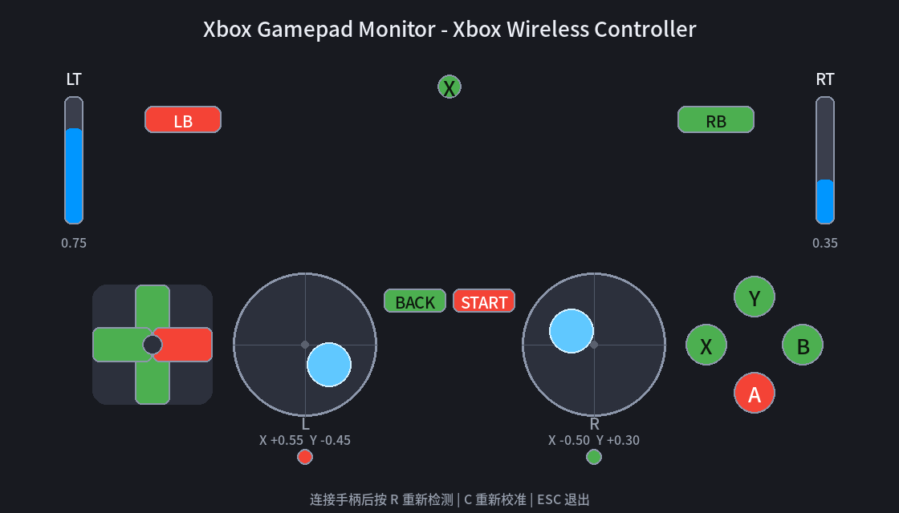

# Xbox 手柄实时状态可视化（Pygame）

用 Pygame 实现的 Xbox 手柄状态监视器：打开页面即可实时看到左右摇杆、扳机、
按键、十字键的当前状态，按下为红色、释放为绿色，与真实手柄一一对应。

## 运行环境

- Python 3.9 及以上（推荐 3.11）
- pygame 2.0 及以上（在 2.6.1 下测试通过）
- 系统需有可用的显示器（窗口程序，非无头运行）
- 一个 Xbox 手柄（USB / 蓝牙均可）

安装依赖：

```bash
pip install -r requirements.txt
```

## 如何运行

```bash
python xbox_gamepad_monitor.py
```

常用命令行参数：

| 参数 | 作用 |
| --- | --- |
| `--calibrate` | 启动时强制进入键位校准（忽略已有映射文件） |

## 打包成独立应用（Linux）

已用 PyInstaller 打包为单个可执行文件，运行不依赖 Python 环境。

### 双击打开（推荐）

项目里提供了桌面启动文件 `xbox_gamepad_monitor.desktop`（带图标、无终端窗口）：

- 直接双击 `xbox_gamepad_monitor.desktop` 启动（如提示“不信任”，右键 → 属性 →
  “允许作为程序执行”）；
- 或安装到系统应用菜单：

```bash
chmod +x xbox_gamepad_monitor.desktop
cp xbox_gamepad_monitor.desktop ~/.local/share/applications/
```

之后可在应用菜单中搜索 “Xbox Gamepad Monitor” 启动，图标使用 `icon.png`。

### 命令行运行

```bash
./dist/xbox_gamepad_monitor
```

- 首次运行（或没有映射文件时）会自动进入键位校准；
- 校准映射 `xbox_gamepad_mapping.json` 会保存到可执行文件旁边（`dist/` 目录）；
- 需要重新打包时，在项目目录执行（`--windowed` 表示无终端窗口版）：

```bash
pip install pyinstaller
python -m PyInstaller --noconfirm --clean --onefile --windowed --name xbox_gamepad_monitor xbox_gamepad_monitor.py
```

- 图标文件：`icon.png`（桌面图标）、`icon.ico`（多尺寸，供其它平台打包使用）；
- 产物为 Linux x86-64 可执行文件（ELF），SDL 等运行库已内置，仅依赖系统基础库；
  如需在其它发行版上使用，建议在目标机器上重新打包。

### 发布新版本（GitHub Actions 自动打包）

仓库配置了 CI/CD：推送 `v*` 标签即自动在 Linux / Windows 两个平台构建
无终端版可执行文件并发布到 GitHub Release：

```bash
git tag v1.0.0
git push origin v1.0.0
```

- 版本号取自标签（去掉 `v` 前缀），会写入程序窗口标题并用于产物命名，与 tag 同步；
- 产物：`xbox_gamepad_monitor-<版本>-linux-x86_64.tar.gz`（含二进制、图标、安装脚本）
  和 `xbox_gamepad_monitor-<版本>-windows-x86_64.zip`（含带图标的 exe）。

## 页面元素说明

下图是界面渲染效果（示例状态：左摇杆推向右上、右摇杆推向左下、
LT 按下一半、RT 按下一小段，`LB` / `A` / `Start` / 十字键【右】/ 左摇杆按压
为按下状态，其余为释放状态）：



### 摇杆（左右各一）

- **大圆**：摇杆活动范围底盘；
- **实心小圆（青色）**：摇杆当前所在位置，实时跟随手柄摇杆移动；
  向上推手柄、小圆向上走，方向与真实操作一致；
- 大圆下方显示数值：`X -1.00 ~ +1.00`（左负右正）、`Y +1.00`（上正下负）；
- 摇杆正下方的小圆点是 **LS / RS 按压指示**：按下摇杆变红、释放变绿。

### 扳机（LT / RT）

- 页面左右边缘各有一个**垂直滑块**：按下越多、蓝色填充越高；
- 下方显示数值 `0.00`（松开）~ `1.00`（按满）。

### 按键

所有按键统一用颜色表示状态：

| 颜色 | 含义 |
| --- | --- |
| 🟢 绿色 | 释放 |
| 🔴 红色 | 按下 |

包括：`A / B / X / Y`、`LB / RB` 肩键、`Back`、`Start`、`Guide`（Xbox 键）。

### 十字键（D-Pad）

- 圆角方形底板 + 十字臂（无外圈圆），按下的方向变红；
- 兼容按钮型和帽子型两种手柄（校准时会自动识别并保存映射类型）。

## 操作说明

| 按键 | 作用 |
| --- | --- |
| `ESC` | 退出程序 |
| `R` | 重新检测手柄（拔插后使用） |
| `C` | 重新进入键位校准 |

程序启动后会打印手柄信息（名称、轴数、按键数、帽子数）到终端，便于核对。

## 键位校准（重要）

首次启动（或 `xbox_gamepad_mapping.json` 不存在）时，会自动进入键位校准；
也可以在任意时候按 `C` 或加 `--calibrate` 参数强制校准。

校准共 **21 步**，按顺序引导操作：

1. 左摇杆：向左推、向上推
2. 右摇杆：向右推、向上推
3. 左扳机 `LT`、右扳机 `RT`
4. 按键：`A` `B` `X` `Y` `LB` `RB` `Back` `Start` `Guide`
5. 摇杆按压：`LS`（左摇杆按下去）、`RS`（右摇杆按下去）
6. 十字键：上 / 下 / 左 / 右

每步操作方式：

1. 页面显示操作提示（如“请向左推动【左摇杆】”）；
2. 实际操作对应控件，页面实时显示已检测到的内容（如
   `已记录：axis 0 sign -1`），下方轴值回显中**正在变化的轴会高亮为蓝色**；
3. 操作完成后按 **`Enter`** 确认，自动进入下一步；
4. 按 **`ESC`** 可跳过当前项（保留默认映射）；
5. 关闭窗口可退出校准。

校准完成后映射自动保存到项目目录下的 `xbox_gamepad_mapping.json`，
下次启动直接读取，无需重复校准。

> 提示：校准会按你的实际手柄记录每个控件的轴 / 按钮编号与方向，因此
> 换手柄、换电脑后建议重新校准一次。

## 映射文件说明

`xbox_gamepad_mapping.json` 保存校准结果，结构如下：

```json
{
  "axes":    { "lx": {"axis": 0, "sign": -1}, ... },
  "triggers":{ "lt": {"axis": 5, "sign": 1}, ... },
  "buttons": { "A": 0, "B": 1, ..., "LS": 9, "RS": 10 },
  "dpad":    { "up": {"type": "button", "button": 11}, ... }
}
```

- `sign`：轴方向（+1 表示原样，-1 表示取反）；
- `dpad.type`：`button` 表示十字键是独立按钮，`hat` 表示帽子型；
- 删除该文件并重启，即可回到首次启动的自动校准流程。

## 常见问题

**校准后某个按键或方向不对？**
按 `C` 重新校准，或删除 `xbox_gamepad_mapping.json` 后重启。

**按扳机 / 按键时页面提示“等待操作”？**
确认校准页下方实时回显中对应的轴（如 `A4`/`A5`）或“按下的按键”是否有变化：
有变化说明信号已到，确认后按 Enter 即可；没有变化说明该控件不在当前候选范围，
可按 `ESC` 跳过该项，完成后检查映射文件。

**手柄拔了再插没反应？**
按 `R` 重新检测，或直接重启程序。

**界面文字变成英文？**
程序会自动查找系统中文字体，找不到时回退为英文提示，不影响功能。

## 文件结构

```
xbox_gamepad_monitor/
├── .github/workflows/
│   └── release.yml              # CI/CD：标签推送自动打包并发布 Release
├── xbox_gamepad_monitor.py      # 主程序（源码）
├── dist/
│   └── xbox_gamepad_monitor     # 本地打包的可执行文件（无终端版）
├── xbox_gamepad_monitor.desktop # 桌面启动文件（双击启动、带图标）
├── icon.png                     # 应用图标（桌面用）
├── icon.ico                     # 多尺寸图标（其它平台打包用）
├── requirements.txt             # Python 依赖清单
├── xbox_gamepad_mapping.json    # 校准映射（首次校准后生成）
├── ui_screenshot.png            # README 用的界面示意图
└── README.md
```
